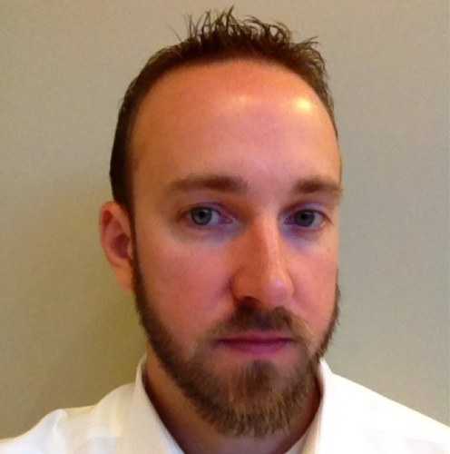

+++
template = "page.html"
date = 2010-08-26
title = "About Sean Kearney"
description = ""

aliases = ["/page/About", "/page/About.aspx"]
+++

  I'm Sean Kearney, an entrepreneur, technology leader, and developer. Since 2000, I've been passionate about software development and technology, sharing some of my insights and experiences here. Since about 2017, I've been working on My DJ Cloud and Digital DJ Pool, where I'm the technical co-founder. I've been primarily focused on .NET, TypeScript, Vue.js, Electron, Azure, and other technologies in the music industry.

You can find me on [Twitter/X](https://x.com/seankearney), [GitHub](https://github.com/seankearney), [Stack Overflow](https://stackoverflow.com/users/255194/sean-kearney), and [LinkedIn](https://www.linkedin.com/in/skearney).

## Professional Background

Prior to my roles at My DJ Cloud and Digital DJ Pool, I served as the Director of Software Development (and other titles) at Hedgehog Development for 10 years, leading a team of nearly 100 developers and architects. While there, I worked with many well-known companies such as FedEx, The Metropolitan Museum of Art (The Met), The Kennedy Center, DOW Chemical, CamelBak, and more, helping them with their digital transformation goals. My expertise spans a diverse range of technologies, including .NET, Sitecore, Azure, TypeScript, and Vue.js, and I have a track record of creating scalable, innovative solutions. I was a Sitecore MVP from 2009-2017.

I've started and [sold](/post/the-sale-of-rswarrior-com/) a number of other businesses, including rswarior.com and longislandboatworld.com. I've also built a number of developer tools, with the most successful being "[Team Development for Sitecore](https://www.teamdevelopmentforsitecore.com/TDS-Classic)" and "[Feydra](https://www.teamdevelopmentforsitecore.com/Feydra)" that are in use by Sitecore developers worldwide.

## Random Facts 

- I was on [Romper Room and Friends](https://en.wikipedia.org/wiki/Romper_Room) as a child in the 80's.
- I've surfed since I was a kid (although I am not good) and met my wife while surfing.
- I have four children: a [son](/post/my-life-will-be-forever-different/) born in 2008 and [triplet daughters](/post/surprise-its-triplets/) born in 2011.
- I was on [George to the Rescue](https://www.nbcnewyork.com/entertainment/the-scene/george-to-the-rescue/) twice: [Season 2 Episode 2](https://www.youtube.com/watch?v=CsHxE_hW1Fo) and [Season 5 Episode 7](https://www.peacocktv.com/watch-online/tv/george-to-the-rescue/5791501842563312112/seasons/5/episodes/revisit-episode-7/20a44b16-15eb-3a9c-a0fa-5c10c5d8b4e3).
- I'm much taller than I look while on a Slack call.
