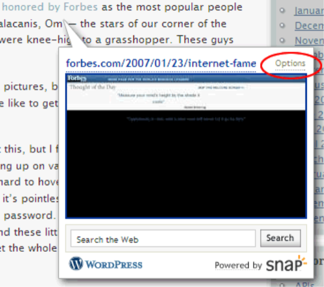

+++
date = 2007-01-26
slug = "snap-no-more!"
title = "Snap no more!"
description = ""

[taxonomies]
tags = ["Rant"]
+++

Apparently I am not the only one to think that "Snap" is one of the most [annoying trends](http://scripting.wordpress.com/2007/01/25/scripting-news-for-1252007) in the web/blog-sphere these days! When I mouse over a link I almost always am doing it to either 1) click on it or 2) see where it is pointing to in the status bar. When that window pops up it always grabs my attention and usually leads to an explicative flying out of my mouth.

<!-- more -->

For all you Snap Haters out there, hate no more because you can disable Snap! Mouse over a Snap pop-up and click on options, the you can opt-out for all sites!

Good Riddance.

