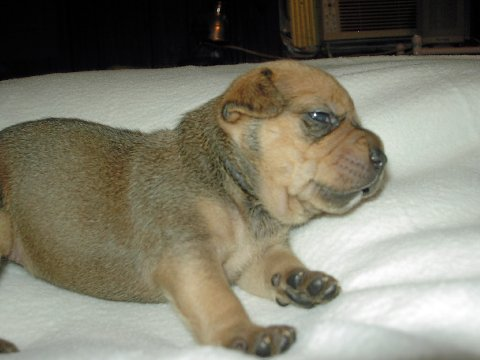
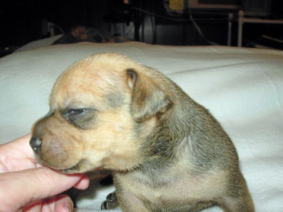

+++
template = "post.html"
date = 2007-05-08
slug = "my-life-may-be-forever-different"
title = "My life may be forever different..."
description = ""

[taxonomies]
tags = ["Personal"]
+++

<!-- more -->

This past weekend, my wife and I took a trip out to New Jersey to go to an AKC dog show and meet with a dog breeder. While, for some, this may not be an event worthy of a blog post, for me however, it is a jaw dropper! My family is one big group (3 siblings) of non animal lovers. For me to go to a dog show (out of state no less), meet a breeder, and *drum roll* put a deposit on a dog would be heresy!

My wife grew up with pets and has wanted one since day one of our relationship. I am allergic to cats, which is what she would have liked, but I am not allergic to dogs. After being married for almost 2 years and just settling into our new home I finally feel I am up to the responsibility. We shall see.

So, with the pups expected to be born this week the breeder is thinking mid-July will be when they are ready to go home. Is my life as I know it over this summer?

In case you are interested, we are getting a [Staffordshire Bull Terrier](http://en.wikipedia.org/wiki/Staffordshire_Bull_Terrier).

**** Update: We passed on the liter that was born. We are now waiting on a male from a litter that was born in July and we should have him in September!** 

**Here he is at 6 weeks** 

