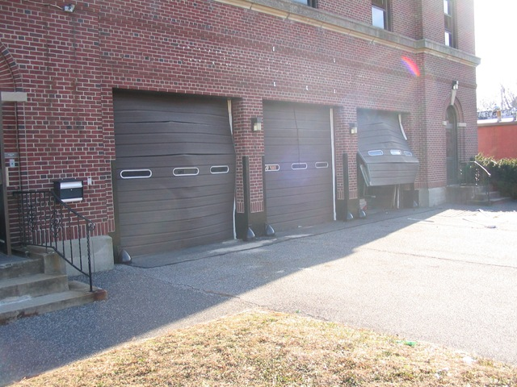
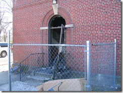
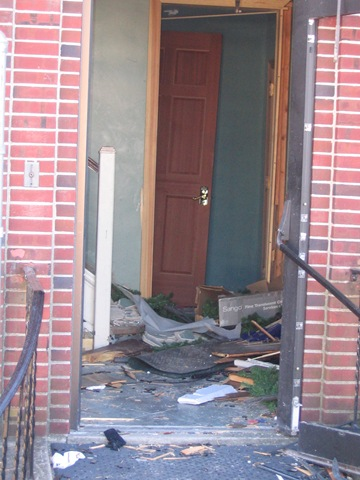

+++
template = "post.html"
date = 2008-01-06
slug = "for-god-sake-man-backup-everything"
title = "For god sake man... Backup Everything"
description = ""

[taxonomies]
tags = ["Web Server"]
+++

I had a fun Friday. I woke up at my usual time (6am) and dove into my usual routine. While the wife is in the shower I jumped on the computer and my browsers default home page (www.carknee.com) wasn't coming up. humm. Checked a different site on the same server (www.rswarrior.com) and that wasn't responding. Can I ping it? Nope. *dang* I tried pinging a couple other servers in the facility, but they weren't responding either. Double dang. I went to work and figured a bad switch was being replaced and it would be back up when I got to the office.

<!-- more -->

At 7:30am, still no server so I called the web hosting facility... no answer and no voice mail!?!?!? At 8am I called the owner on his cell phone (it is nice to work with small companies), but no answer. At 8:30am I called again, but this time I got an answer! He said he can't get into the building because the Arson squad is still investigating. SAY WHAT? Apparently the web hosting facility had a gas explosion.

My [co-located web server](/post/new-server) is now off the grid sitting in a war zone. Initial thoughts went as follows.

*   Shit.
*   Was there, and if so how bad was the, fire?
*   If it survived the fire, would there be water damage?
*   If there was no fire or water damage, would it survive the pressure of the explosion?
*   If it survived all that, would it be ok in a room that could have collapsed in on itself?
*   Oh shit, I'm f'ed.
*   When were my last backups? Where can I host a backup server before end of business on Friday?
*   Oh shit... I'm really f'ed

So, around 10am I drove to the web hosting facility (again, nice to work with small local companies). The owner was there, but he had yet to go in. The scene was covered with the local Gas companies workers and the fire marshal still wasn't letting the owner in. I left around 10:45 since there was no way I was getting to get what ever was left of my box.

Numerous conversations with owner over the course of the afternoon, but he was still not allowed in the building. I showed up back at the facility around 5:15pm and he still wasn't allowed in. An asbestos removal team was finishing up and he said I can get in around 7pm. Rather than showing up at 7pm I figured I would just call this time... he picked up and I could sense the relieved tone in his voice! He said, "oh, you didn't know? Your server came back online at 6:30!" Wow. He boarded up the blown out windows and doors, brought in ancillary generators and got some of his facility back up and running. His main generator was out of commission since it ran on natural gas.

I was down for about 12 hours total, but what would I have done if my box hadn't survived this? I had a database backup from a month ago. I had critical web applications on my development PC that I could have deployed, but most everything else would have been gone. Years of data up in a cloud of smoke.

Why don't I have a disaster recovery plan or backup strategy in place you ask?

1.  I never expected my facility to blow up. I have RAID'ed drives and figured worse case a drive would go bad on me. Two can't go bad at once, right?
2.  I did have a backup server running at my home. However, I never stuck to my manual backup process and I ran out of disk space!

Lessons learned:

1.  Shit happens! You know that worse case scenario you think about, but figure it can't happen? It happened.
2.  Backup everything --everyday-- and keep it offsite! RAID is great, but it won't save you if your entire server blows up (or gets stolen -- that's another story). [Amazon S3](http://aws.amazon.com/s3) time perhaps?
3.  Stay friendly with the people at your web hosting facility! I was one of the first servers he powered on. If I wasn't onsite, and calling him regularly, my server might have been sitting under rubble for the weekend.

Someone posted this as a joke when they heard of my misfortune   

> An unwritten rule of thumb in IT management:
> if an organization has no database backup
> and no database backup strategy,
> and no database backup contingency strategy
> then the organization has
> no organizational intelligence.

Live and learn I guess.