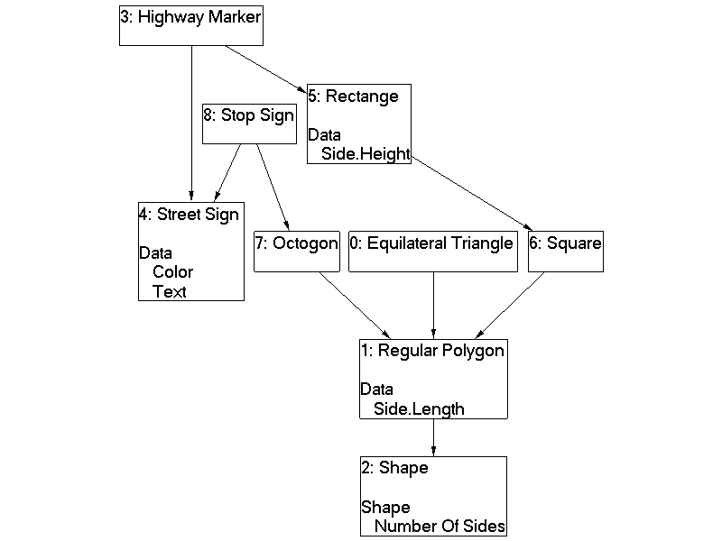

+++
date = 2008-04-09
slug = "sitecore-template-diagrams"
title = "Sitecore Template Diagrams"
description = ""

[taxonomies]
tags = ["Sitecore", "Template Diagrams", "Information Architecture"]
+++

With [Sitecore](http://www.sitecore.net/) templates, unlike C#, you are allowed to inherit from multiple bases. This allows Sitecore developers to be extremely flexible in their implementations, but as with most applications, flexibility adds complexity.   

<!-- more -->

My current Sitecore project has hundreds of templates, inheriting from upwards of five base templates, with up to 6 levels of inheritance! On a single person "team" managing these templates and their inheritance might be doable, but once you have five developers adding or changing templates, fields, sections, bases, etc... it can get out of control and hard to manage really fast! What we needed was the equivalent of a class diagram to lay out or templates and their hierarchy.  

Using some good 'ole [graph theory](http://en.wikipedia.org/wiki/Graph_theory) -- and some assemblies found on the net -- I now can look at template diagrams like this:

*   Each box represents a Sitecore template. 
*   The "Number:" can be ignored
*   The Text at the top is the name of the template
*   The 2nd row of Text, which isn't indented, is the field section
*   The indented row of text is the field name

So, the "Highway Marker" template has the following fields:

*   Color
*   Text
*   Side.Height
*   Side.Length
*   Number of Sides 

Obviously, I can not share the actual template structure of my current project, and this is an extremely trivial example. If you want to see what can be generated from your complex structure drop me an email.  

 Sorry, but I can not share the code either.