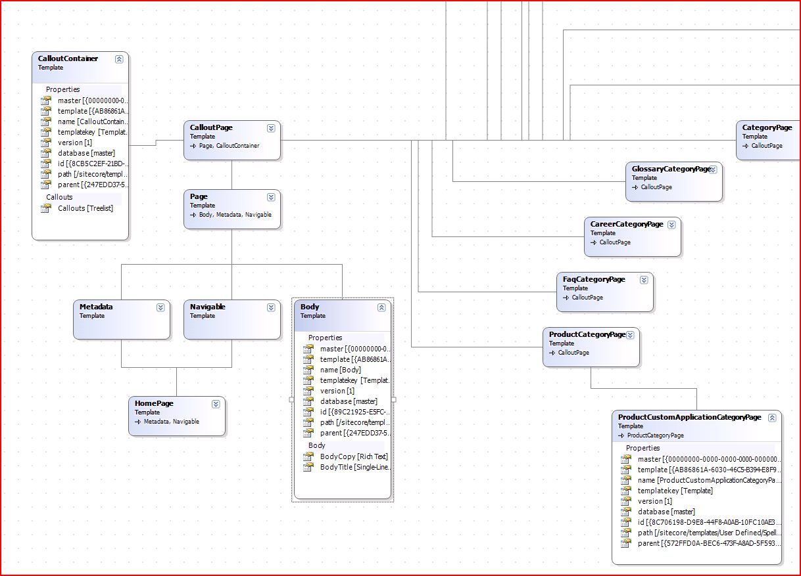

+++
template = "post.html"
date = 2008-11-07
slug = "sitecore-diagrams-part-2"
title = "Sitecore Diagrams Part 2"
description = ""

[taxonomies]
tags = ["Sitecore", "Template Diagrams"]
+++

We have been doing some pretty fun work with [Sitecore](http://www.sitecore.net/) 6 here at [Hedgehog Development](http://www.hhogdev.com)... I started doing some work with [Sitecore Template Diagrams](/post/sitecore-template-diagrams) a while back and I got to talking with some colleagues and we decided to take this to another level. While I can't get into the specifics (just yet) about the entire project I can show you the diagrams being generated!

<!-- more -->

The previous version of the diagrams were simply jpg files being generated on the web server. While they were useful for seeing quick representations of your templates, it wasn't too interactive. This new version is tied to the serialization of items in Sitecore and therefore allows you to work outside of a Sitecore context. It is a Windows user control with the ability to move the items around and the future possibility of editing, updating, etc... 

This particular screen shot is showing Sitecore template items of sample web site. As you can see we are showing some basic properties of the item as well as building up the sections and fields of the template. We can also enable showing standard values as well as non-template items (content) however, the graphs aren't as much fun.

This is just the tip of the iceberg of what is happening here. As soon as I get clearance I will share more.