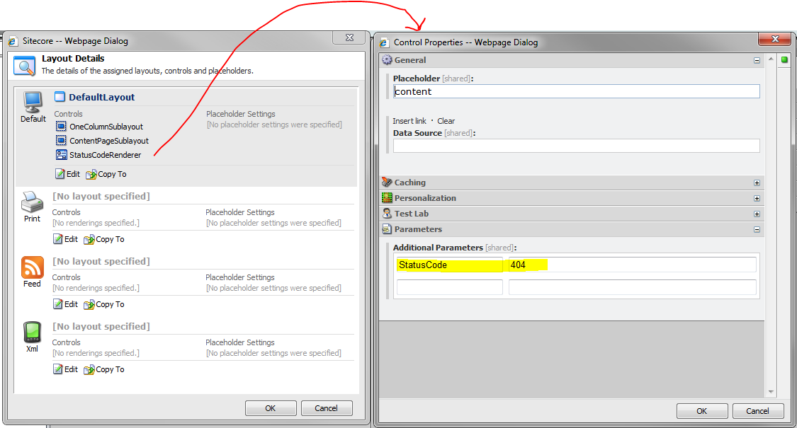

+++
template = "post.html"
date = 2009-12-28
slug = "simple-404-with-sitecore"
title = "Simple 404 with Sitecore"
description = ""

[taxonomies]
tags = ["Sitecore", "Shared Source"]
+++

404's in Sitecore can be very simple or extremely complicated with site independent designs and functionality. While a blog post on the later would be a worthwhile blog post, this post will cover a very simple example of how to set the StatusCode of any page in your Sitecore installation.

<!-- more -->

For one of my current projects the custom 404 page is going to look and function just like every other 'normal' page in the site. The one difference is that the [StatusCode](http://msdn.microsoft.com/en-us/library/system.web.httpresponse.statuscode.aspx) should be set as a 404 (not a 200) on the way out to the client. It is very common for a custom design or functionality on a 404 page so a new sublayout is usually the best route. However, as mentioned, this site's 404 page is just like every other page so I couldn't see the value in creating a new sublayout with all the same markup to simply set the StatusCode on the way out. What I did was create a web control the will set the status for us.

Here is the code for the Web Control:

```c#
public class StatusCodeRenderer : Sitecore.Web.UI.WebControl  
{  
    private NameValueCollection _renderingParameters;  

    protected override void DoRender(System.Web.UI.HtmlTextWriter output)  
    {  
        if (!string.IsNullOrEmpty(RenderingParameters["StatusCode"]))  
        {  
            int code = 0;  
            if (!int.TryParse(RenderingParameters["StatusCode"], out code))  
                code = 0;  

            if (code > 0)  
            {  
                Context.Response.StatusCode = code;  
            }  
        }  
    }  

    private NameValueCollection RenderingParameters  
    {  
        get  
        {  
            if (_renderingParameters == null)  
            {  
                _renderingParameters = StringUtil.ParseNameValueCollection(Parameters, '&', '=');  
            }  
            return _renderingParameters;  
        }  
    }  
}
```

I then registered the Web Control in Sitecore @ `/sitecore/layout/Renderings/StatusCodeRenderer` using the Assembly and Namespace that this class lives in.

To use my new Web Control I go to the content item I created to be the 404 page (/sitecore/content/Home/page-not-found). I go to presentation settings and add in my Web Control as follows. (The OneColumnSublayout and ContentPageSublayout are used on every other page in the site. I simply added the new WebControl)



Now every request to the page-not-found item will result in a Status Code of 404 being sent back to the client. Don't forget to update the web.config file to point to this item and update IIS to point here as well. This could be used to set other status codes as well, but you will need to add in some functionality to make them useful.