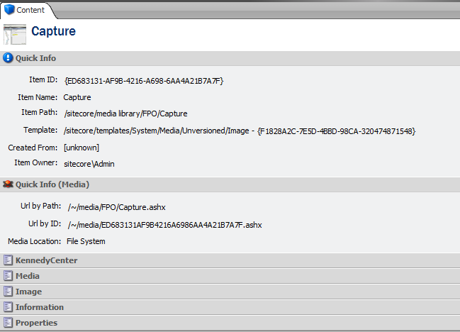

+++
template = "post.html"
date = 2010-08-05
slug = "sitecore-media-url"
title = "Sitecore Media URL"
description = ""

[taxonomies]
tags = ["Sitecore"]
+++

For one of my the latest projects the content editors were always trying to get the actual URL to a Sitecore media library item, but there is no easy way to see this in Sitecore. As developers we know it is in the form of /~/media/[ShortID].ashx or /~/media/[Path].ashx, but editors don't want to think about that. They just want it figured out and displayed in front of them.

<!-- more -->

What I wanted was something similar to the "Quick Info" section that gives develoeprs/admins a quick view into the important properties of a Sitecore item. This is what I came up with.



This minor change to the editor will allow a user to click on the URL of their choice and copy it to the clipboard.

To add this to your site you need a single class and a change to a pipeline.

```c#
/// <summary>  
/// The ShowMediaPath class.   
/// </summary>  
public class ShowMediaInfo  
{  
    private static readonly string SECTION_NAME = "MediaInfo";  

    /// <summary>  
    /// Gets a value indicating whether this section is collapsed.  
    /// </summary>  
    /// <value>  
    ///     <c>true</c> if this section is collapsed; otherwise, <c>false</c>.  
    /// </value>  
    private static bool IsSectionCollapsed  
    {  
        get  
        {  
            UrlString collapsedSections = new UrlString(Registry.GetString("/Current_User/Content Editor/Sections/Collapsed"));  
            string value = collapsedSections[SECTION_NAME];  
            return (string.IsNullOrEmpty(value) || (value == "1"));  
        }  
    }  

    /// <summary>  
    /// Processes the specified args.  
    /// </summary>  
    /// <param name="args">The args.</param>  
    public void Process(RenderContentEditorArgs args)  
    {  
        Item current = args.Item;  
        if (current != null && current.Template.FullName.StartsWith("System/Media"))  
        {  
            MediaItem mediaItem = current;  

            if (mediaItem != null)  
            {  
                bool renderMediaInfo = !IsSectionCollapsed || UserOptions.ContentEditor.RenderCollapsedSections;  

                args.EditorFormatter.RenderSectionBegin(args.Parent,  
                    "MediaInfo",  
                    SECTION_NAME,  
                    "Quick Info (Media)",  
                    "People/32x32/atom.png",  
                    IsSectionCollapsed,  
                    UserOptions.ContentEditor.RenderCollapsedSections);  

                if (renderMediaInfo)  
                {  
                    RenderMediaInfo(args, mediaItem);  
                }  

                args.EditorFormatter.RenderSectionEnd(args.Parent, renderMediaInfo, true);  
            }  
        }  
    }  

    /// <summary>  
    /// Renders the media info.  
    /// </summary>  
    /// <param name="args">The args.</param>  
    /// <param name="mediaItem">The media item.</param>  
    private static void RenderMediaInfo(RenderContentEditorArgs args, MediaItem mediaItem)  
    {  
        StringBuilder sectionText = new StringBuilder();  

        sectionText.Append("<table cellpadding=\"4\" cellspacing=\"0\" border=\"0\">");  
        sectionText.Append("<col style=\"white-space:nowrap\" align=\"right\" valign=\"top\" />");  
        sectionText.Append("<col style=\"white-space:nowrap\" valign=\"top\" />");  

        // we will give them absolute URL's  
        MediaUrlOptions o = new MediaUrlOptions { AbsolutePath = true };  

        // Get the path of the media item using it's path  
        o.UseItemPath = true;  
        sectionText.Append("<tr><td>Url by Path:</td><td>");  
        sectionText.AppendFormat("<input class=\"scEditorHeaderQuickInfoInput\" readonly=\"readonly\" onclick=\"javascript:this.select();return false\" value=\"{0}\"/>", MediaManager.GetMediaUrl(mediaItem, o));  
        sectionText.Append("</td></tr>");  

        // Get the path of the media item using it's ID  
        o.UseItemPath = false;  
        sectionText.Append("<tr><td>Url by ID:</td><td>");  
        sectionText.AppendFormat("<input class=\"scEditorHeaderQuickInfoInput\" readonly=\"readonly\" onclick=\"javascript:this.select();return false\" value=\"{0}\"/>", MediaManager.GetMediaUrl(mediaItem, o));  
        sectionText.Append("</td></tr>");  

        // is it File or DB media?  
        sectionText.Append("<tr><td>Media Location:</td><td>");  
        sectionText.Append(mediaItem.FileBased ? "File System" : "Database");  
        sectionText.Append("</td></tr>");  

        sectionText.Append("</table>");  

        args.EditorFormatter.AddLiteralControl(args.Parent, sectionText.ToString());  
    }  
}
```

You will need also to modify a pipeline. I would suggest creating a ShowMediaInfo.config in the /App_Config/Include directory with the following:

```xml
<configuration xmlns:patch="http://www.sitecore.net/xmlconfig/">  
  <sitecore>  
    <pipelines>  
      <renderContentEditor>  
        <processor patch:before="processor[@type='Sitecore.Shell.Applications.ContentEditor.Pipelines.RenderContentEditor.RenderSkinedContentEditor, Sitecore.Client']"  
                   type="NAMESPACE.ShowMediaInfo, ASSEMBLY" />  
      </renderContentEditor>  
    </pipelines>  
  </sitecore>  
</configuration>
```

The idea for this was based on some code that a colleague of mine at [Hedgehog Development](http://www.hhogdev.com) had written