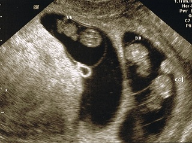

+++
template = "post.html"
date = 2011-01-27
slug = "surprise-its-triplets"
title = "Big News of 2010: Surprise, it's triplets!"
description = ""

[taxonomies]
tags = ["Personal"]
+++

Looking back at 2010 I can confidently say the biggest news I was hit with was that I am having triplets. A pair of identicals girls and a singleton girl to be exact. This is, of course, in addition to my [two year old son](/post/my-life-will-be-forever-different). I always wanted four kids so I am pretty stoked!

<!-- more -->

The actual due date is April 29, 2011 but as you can imagine we are expecting them a bit earlier. The average gestational period for triplets is 33 weeks, which puts them around March 11.

Needless to say things have been changing in my world. The most recent would be the [sale of a web site I owned](/post/the-sale-of-rswarrior-com). I hope to have some more good news as soon as next week and I'll save that for another post.

I did stumble on this video and must say it has summed up a lot of my conversations recently and I imagine how they will be for a long time.