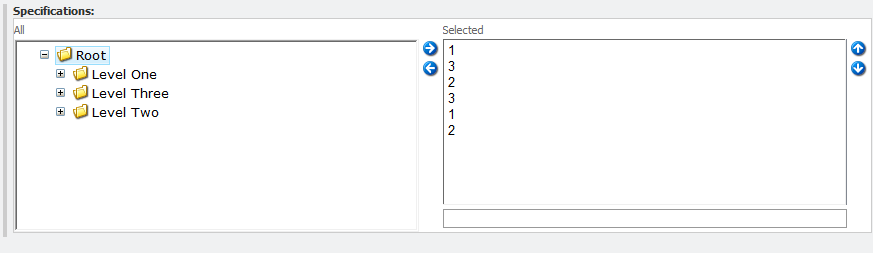
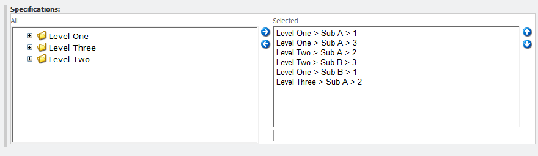

+++
date = 2012-02-02
slug = "sitecore-descriptive-tree-list-field-type"
title = "Sitecore Descriptive Tree List Field Type"
description = ""

[taxonomies]
tags = ["Sitecore", "Shared Source"]
+++

Have you ever had a TreeList field in Sitecore only to see this when editing an item?

<!-- more -->

There is no easy way to tell what is actually selected! Now, sure, you can rename the 1/2/3 items to be more descriptive, but that feels clunky to me. I've seen this a few times in Sitecore solutions we've inherited as well as ones we've created and I felt it was time to resolve this. I feel that a much better way to render a Tree List field would be this:

There are only three things required to make this happen.

1.  Add an item into the core database to define the new field type
2.  Code for the field type
3.  A config file to wire it all up

You can grab the source code and standard Sitecore package [on GitHub](https://github.com/HedgehogDevelopment/sitecore-DescriptiveTreelist).