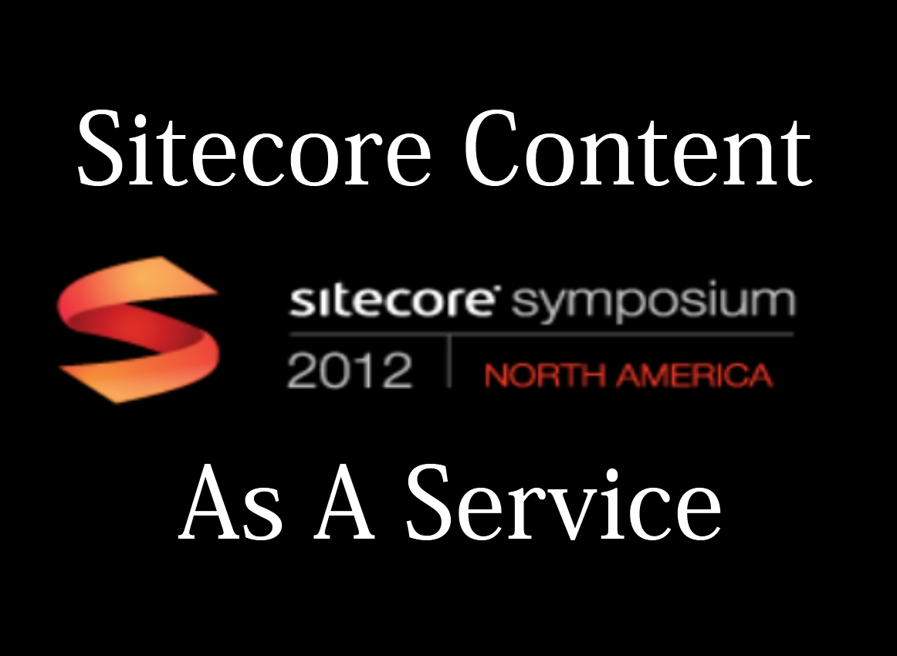

+++
date = 2012-11-01
slug = "sitecore-content-as-a-service"
title = "Sitecore Content as a Service"
description = ""

aliases = ["/post/Sitecore-Content-as-a-Service"]

[taxonomies]
tags = ["Sitecore"]
+++

Disclaimer: This post was in a draft state for many, many, months. It was started and subsequently turned into my Sitecore Symposium 2012 talk. Now that SitecoreSym is over I am making this post and the associated code available.

<!-- more -->

We have started to see a rise in requests to create "[single page applications](https://en.wikipedia.org/wiki/Single_page_application) (SPA)" and with [MVC4 supporting this](http://www.asp.net/single-page-application) it confirms it isn't something to ignore. Similar to Single Page Apps, we have all seen a surge in mobile applications that require content. Both of these scenarios move rendering logic from the server to the client whether it be JavaScript, cocoa touch, etc... "This results in the role of the web server evolving into a pure data API or web service."[[1][1]] Sitecore doesn't provide for a consumable content API out of the box and does require some plumbing to allow clients to pull content out. It was from these requests that we've dubbed "Sitecore Content as a Service." 

In order to use Sitecore content, in an SPA or mobile device, we need an easy-to-consume content service. The ultimate goal will be to have a clean REST API that is consumable by any potential client such as a Javascript MVC framework like Backbone.js or an iOS device. There are, however, a few server side things required to make this happen.

Sitecore has a robust API revolving around "Items" and "Fields". Sitecore's Item is a very heavy object with a lot of convenience methods and properties to things like 'Parent', 'Axes', 'Children', etc... A Sitecore Field is also very heavy with various versions for images, links, references, etc... Exposing these objects to clients wouldn't be ideal since they expose a lot of extras that are of no concern. Furthermore, trying to serialize these objects into JSON (the REST API serialization format of choice) would prove to be difficult if not impossible.

So we recognized that Sitecore falls a little short with trying to get content out. Here is what we need:

- "Sitecore Navigator"
- POCO content models
- Mapping framework
- Efficient JSON Serialization
- Service endpoint inside of Sitecore

**"Sitecore Navigator"**
The "Sitecore Navigator" is a trivial piece of the solution. It is simply a way by which we can get a Sitecore item with some unique identifier. This is almost as simple as `Sitecore.Context.Database.GetItem(id);`

**POCO Content Models**

**P**lain **O**ld **C**LR **O**bject (POCO) are objects unencumbered with inheritance or attributes needed for specific frameworks[[2][2]]. We want a set of these models, or classes, that represent our Sitecore templates. For each template we have we will have a corresponding .net class.
 
**Mapping Framework**
We need some method by which we can convert, or map, a Sitecore item into one of our POCO classes. Our weapon of choice is a convention based mapping framework. We will use reflection magic to determine what class to instantiate and populate based on a naming convention between Sitecore template and .net class.

**JSON Serialization**
We need to serialize our classes in order to server them over an API. JSON serialization is the way to go and ASP.NET Web API has it built in. Win!

**Service Endpoint**
In order for an external application to get Sitecore content out, the external application needs some endpoint to call. For our implementation we will use the newly released ASP.NET Web API. This allows us to define a route to a service controller. Our controller actions allow the applications to get content out.

The code has just been released on GitHub @ [https://github.com/HedgehogDevelopment/sitecore-content-service](https://github.com/HedgehogDevelopment/sitecore-content-service)

[1]: https://en.wikipedia.org/wiki/Single_page_application
[2]: http://en.wikipedia.org/wiki/Plain_Old_CLR_Object