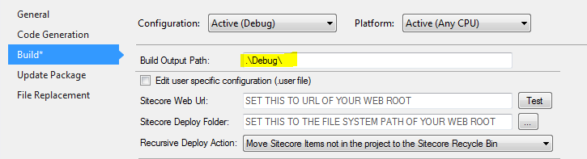
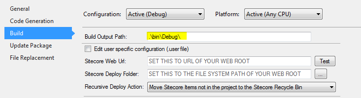

+++
template = "post.html"
date = 2013-01-04
slug = "using-team-development-for-sitecore-with-github"
title = "Using Team Development for Sitecore (TDS) with GitHub"
description = ""

[taxonomies]
tags = ["Sitecore", "TDS", "git", "serialization"]
+++

When using Team Development for Sitecore (TDS) you may need to tell your source control system how to handle certain files. This post is mainly targeted to folks using Git as their source control system, but it could be a general guideline for people using any source control system that isn't integrated with Visual Studio.

<!-- more -->

## Excluding Certain Files

TDS creates a few files on your disk that shouldn't be included with source control. These files are typically user specific files and/or build generated files. Here is a list of files and directories (with a wildcard character) that should be ignored.

- `*.scproj.user`
- `T4RenderCache/`
- `IconCache/ `
- `BuiltFiles_*.txt`
- `Package_*/`

Also worth noting is that TDS is configured with configuration specific 'Build Output Paths.' This means that when you build your TDS project "Debug," "Release," "[custom config]" directories are created. If you only have 'Debug' and 'Release' then there shouldn't be much of a problem if you are using Git since GitHub's default `.gitignore` file will exclude them. However, any custom configuration build output directories may be picked up as an 'uncommitted change'. I recommend manually changing your TDS Build Output Path to be `.\bin\[Config Name]` rather than the default `.\[Config Name]` to prevent custom config build outputs from accidentally being checked into Git.

Change this:



To this:



After you change your build output path, here are some lines you should add to your `.gitignore` when using a TDS project:

```
#############
## Hedgehog Development's Team Development for Sitecore
#############
IconCache/
T4RenderCache/
BuiltFiles_*.txt
```

## Handling Line Endings

The [Sitecore Serialization Format](/post/sitecore-serialization-format) is rather strict especially with line endings. There may be instances where you have a Rich Text field that was serialized to have a mix of CRLF and LF. If you are using the default GitHub .gitattributes file you can run into issues. To get around this you can modify your .gitattributes file with these lines: (*thanks to [Nick Wessleman](http://www.techphoria414.com/Blog) for discovering this issue*). 

 # Custom for TDS/Sitecore serialization 
*.item -text   

If you've already added `.item` files to your repo without setting the `.gitattributes`, you may see errors like this:

```
System.Exception: Failed to load version 1 for language en ---> 
System.Exception: Length of field content does not match the content-length attribute. Field name: xxxx, field id: {4B1DF5BC-C670-41DD-800E-F8079ECE09CA}
```