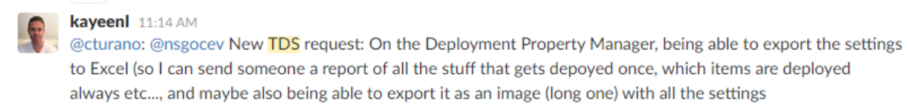

+++
date = 2016-03-23
slug = "tds-deployment-properties-report"
title = "TDS Deployment Properties Report"
description = ""

[taxonomies]
tags = ["TDS"]
+++

In the [Sitecore Slack Team](http://sitecorechat.slack.com)'s #TDS channel there was a Team Development for Sitecore feature request from [Robbert Hock](http://www.kayee.nl). It was:

<!-- more -->

*On the Deployment Property Manager, being able to export the settings to Excel (so I can send someone a report of all the stuff that gets depoyed [sic] once, which items are deployed always etc..., and maybe also being able to export it as an image (long one) with all the settings*

 

I'm happy to share a quick way to get such a report today! The TDS project file (`.scproj`) is just an XML file and the deployment properties are stored in that XML. We can simply run an XSLT transform on the TDS project file to get what we want.

I've put this [XSLT file in a Gist](https://gist.github.com/seankearney/bbed9c18564c374f7b6b). Please help make it better!

Run this XSLT through your favorite XSLT processor (download [msxsl.exe](https://www.microsoft.com/en-us/download/details.aspx?displaylang=en&id=21714) from MS if you need one)

Here are the results.

