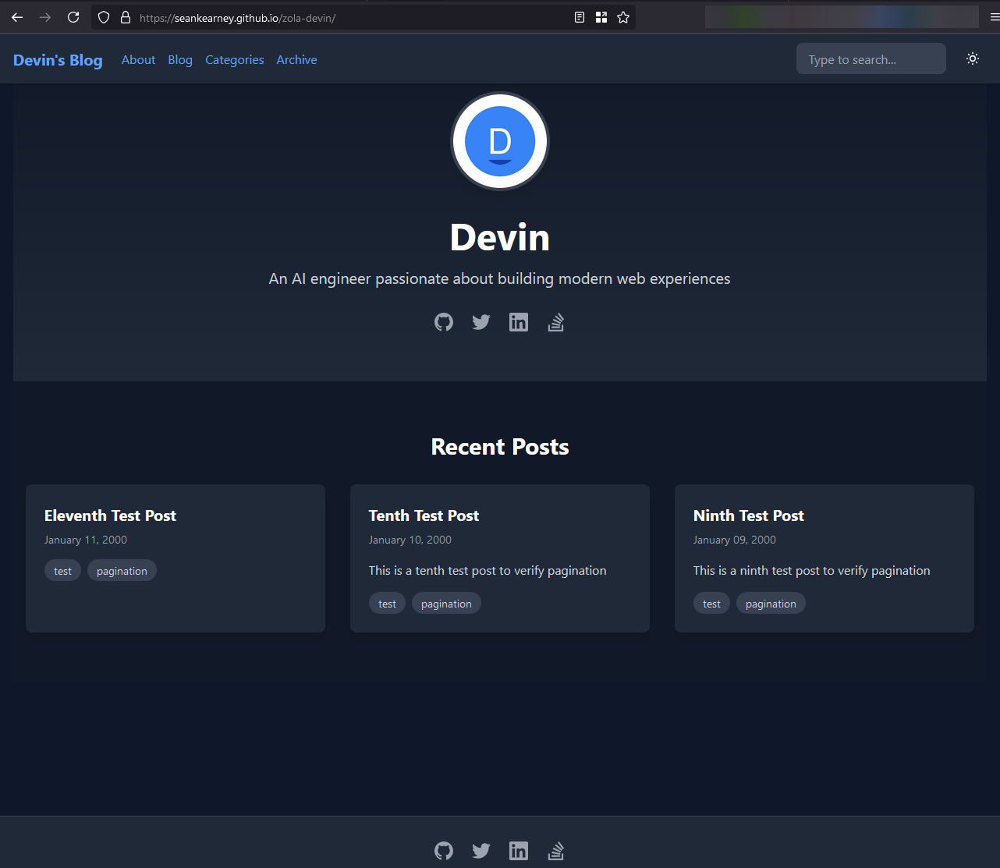

+++
date = 2024-12-25
title = "Devin.ai Builds a Zola Theme"
description = "After previous failed attempts to get Devin.ai to do some real-world work I had it try some real junior stuff. The results are better."

[extra]
promo_image = "promo-devinai-builds-zola-theme.jpg"

[taxonomies]
tags = ["AI", "Zola"]
+++

In the world of AI-driven development, Devin.ai showcases remarkable potential (but certainly some [unremarkable results](@/post/2024-12-21-devinai-vuejs/index.md)) in automating various tasks. This blog post delves into my experience with Devin.ai as I attempt to create a Zola theme using Tailwind CSS and Vanilla JS.

<!-- more -->

> #### TL;DR
> - I'm not a designer.. neither is Devin. BUT Devin is much faster/better at putting something passable together.
> - Like all developers -- requirements matter.
> - Asking for fixes/changes risks undoing progress.

## The Goal

The high-level goals of this test are:

1. **Evaluate Devin.ai on basic front-end tasks**: I wanted to see how well Devin could handle basic HTML markup, CSS, and vanilla JavaScript tasks, as these are essential skills for any front-end developer.
2. **Use Tailwind CSS**: As someone who has never used Tailwind CSS before, this experiment was an opportunity for me to gain exposure and understand its utility and efficiency in a real-world project.
3. **Create a Zola theme for this site**: The end goal was to create a usable Zola theme for my site, something that could potentially replace the existing theme and improve the overall look and feel.

## The Experiment

### Initial Setup

⚠ I must point out that the GitHub repository at [devin-zola](https://github.com/seankearney/zola-devin) **is not** the original repo that Devin worked out of. Devin is tied to my work account and a GitHub organization that I didn't want permanently tied to this theme. So all work (i.e., pull requests) were done elsewhere. When the experiment was complete, I changed commit authors (to remove my work account) and I had to remove a "Co-Authored" disclaimer from every commit that Devin makes. I then pushed to the proper repo. **But every commit is real and actually what Devin did. I did not make any commits to the repo during this time!**

### Initial Readme

It started with a very simple [readme.md](https://github.com/seankearney/zola-devin/commit/8ddc70298815716adc29e8ced8f5a1bcf070ccad). It was purposefully very vague and without any significant requirements or constraints. I provided it a couple of sample `.md` files to use as sample content, basic template requirements and asked it to create a Zola theme with Vanilla JS and Tailwind CSS. It asked some reasonable questions, received answers, and went on its way...

### Refined Instructions

The initial result was not great. It was encouraging for sure, but I could see Devin needed more directions. At this point, I decided to move all instructions into a dedicated file called `devin-instructions.md`. You can see how I refined the requirements and ultimately required Devin to abandon about three attempts in the [history](https://github.com/seankearney/zola-devin/blame/main/devin-instructions.md).

### Final Round

The final attempt is effectively what you see in GitHub at tag [`devin-final`](https://github.com/seankearney/zola-devin/tree/devin-final). This is a working Zola site/theme that met all requirements and looked pretty darn good (better than I'd do in the given time anyway).

### Feedback Rounds

At this point, Devin created the PR, and things were promising enough where I felt it was worth reviewing and giving feedback to Devin. I have nine rounds of feedback for Devin, and after each one, the PR looked better and better. You can look at the history and see each commit that Devin made. Each of these commits stems from feedback that I provided. Here are a few examples of the feedback I provided:

1. "General Tailwind usage: The styling/colors are pretty terrible... feel free to use https://tailwindcss.com/ as a model for styles/colors/etc for our theme. Additionally, we are missing some base, or global, styles that set defaults for basic elements. The `/post/markdown` blog post is the litmus test. ""
2. "The footer is missing requirements #2, 3, & 5"
3. "It appears you may have started using Tailwind Typography plugin, but the npm package isn't specified. I'm unable to run `npx tailwindcss -i ./static/input.css -o ./static/tailwind.css` -- which is preventing me from seeing the site properly"

> 📝 The entire chat history is available [here](chat-log.txt), but is not formatted nicely.

## Insights and Future Work

### Works on Devin's Machine

Devin did a fairly good job and I've done a quick test of the theme with my site's content. At this point, I've "pulled" Devin off of the job. The site "works on my machine," and it is time to ship this. Unfortunately, getting this to work up in GitHub pages did require a few commits from me, but the [Zola-Devin theme demo](https://seankearney.github.io/zola-devin/) site is now running.

Like most other professional developers, I'm still on the fence with AI coding agents. My experiences are initially impressive, but very quickly things seem to fall apart.

This particular experience, with Devin, was pretty good. Once we got past the requirements issue, Devin did work like a junior dev and was able to work through with some help. I think the biggest win for me on this one is that the UI "just worked." Could I use Bootstrap or even Tailwind to style a basic blog? Absolutely, but realistically it would take me hours of looking at the docs and crafting the proper UI, whereas Devin got it pretty good very quickly.

### Lessons Learned

1. **Importance of Clear Requirements**: There is no panacea for lack of requirements. In my 20+ years of experience building applications, "the business" doesn't always know what they want, but they always know what they **don't want** when they see it. I'm no exception. I had a rough idea of what I wanted... "A blog." Devin needed more than that. Fair enough.
2. I provided Devin with some fairly high-level requirements. I outlined what pages should exist and what should be on those pages. Devin had full control over the design/UI of the site. What it did with Tailwind and my description of a "Hero" and "Cards" was spot-on. A+ here, but I'm not sure the results are reproduceable. If I were to give it the same requirements and start over -- it may miss the mark.
3. **Effectiveness of Feedback:** The nine rounds of feedback I had to do were a little more than I'd like, and I was getting frustrated. If this were a "real" junior developer, I'd have more patience and desire to help them. But something about an AI agent getting basic things wrong and requiring me to explain it feels like a waste of my time and energy; I love helping junior devs mature, but teaching an AI agent? 🙃🤔
4. **AI's Learning Curve**: Worth mentioning that the failed attempts were pretty bad. I tried pushing Devin in the right direction, but the changes that were made just made things worse. If Devin doesn't have a clear understanding on the first pass (when the PR is created), you might be better off abandoning the PR and starting over (with better requirements).
5. Zola **with** Tailwind -- This feels like an off combination. I had no exposure to Tailwind going into this. It was just a buzzword to me. After seeing what Tailwind _really_ is, I'm not too sure it has a place in a Zola theme. Zola has its own SASS compilation and ability to customize themes. Tailwind requires a CLI and has its own theme customizations. Effectively, the build process for a Zola site using this devin-zola theme will be more complicated.

### Future Work on Zola-Devin

This experiment was really to see how Devin did with more basic tasks. The result is a usable Zola theme, but it is certainly not "the best" theme out there for everyone. This theme is very specific to my simple blog's needs and is still missing some basic things like favicons and Google Analytics that even I would require. Going forward, I'll probably enhance this a bit and add in some of these little features. Only time will tell if I stick with the theme, but for now it still interests me.
