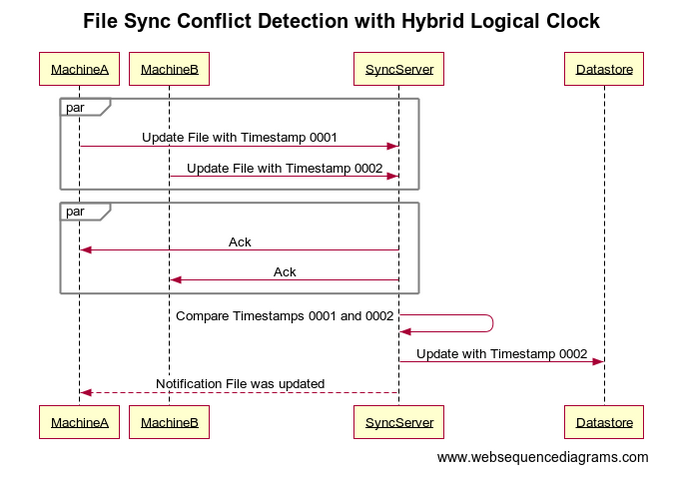

+++
date = 2025-01-07
title = "Conflict Resolution in My DJ Cloud Using Timestamps"
description = "Discover how My DJ Cloud ensures data consistency and integrity with Hybrid Logical Clocks (HLC). Learn about timestamp generation, conflict resolution, and handling concurrent updates across devices."

[taxonomies]
tags = ["Sync"]
+++

At My DJ Cloud, one of the earlier problems we needed to solve when building our file synchronization engine was ensuring data consistency and integrity. With multiple machines modifying the same file simultaneously, the Cloud needs to understand how to handle it. We decided to leverage a Hybrid Logical Clock (HLC) to generate our timestamps when handling conflicts and maintain the latest version of files across devices. This post will provide an introduction into how we utilize HLC for conflict resolution and how our cloud-side system determines which version should be used.

<!-- more -->

## Understanding the Role of Timestamps

Timestamps are unique markers that indicate the time at which an event or operation occurred. In My DJ Cloud, as in message-based systems, they serve as a reliable means to order events and resolve conflicts. By associating each operation with a timestamp, we can easily determine the sequence of events and manage concurrent updates.

## Hybrid Logical Clocks (HLC)

Our Hybrid Logical Clock (HLC) is an advanced mechanism that combines physical time (wall clock time), a logical counter, and a unique machine identifier. Unlike simple timestamps, which only represent the physical time, HLCs provide additional information to maintain a causal relationship between events. This helps in resolving conflicts more effectively by capturing the order of events even in distributed environments where system clocks might not be perfectly synchronized. The logical counter ensures that events occurring at the same physical time are ordered correctly, while the machine identifier helps track which device generated the timestamp.

1. **Wall Clock Time**: The time reported from the operating system (with any adjustments—see clock skew below).
2. **Logical Counter**: Used to handle events that occur within the same "wall clock time." It ensures that events are ordered correctly even if they happen simultaneously or within very short intervals. The logical counter increments whenever multiple events occur at the same physical time, providing a unique sequence number for each event.
3. **Unique Machine Identifier**: Identifies a specific machine for a user.

## Implementing Hybrid Logical Clocks for Conflict Resolution

### 1. Assigning Timestamps

Each device generates timestamps for its operations using a Hybrid Logical Clock (HLC). Our HLC combines physical time, a logical counter, and a machine identifier, providing a robust way to order events. Moreover, we are able to identify which of the users' machines the event originated from.

```
function generateTimestamp(currentTime, lastWallClockTime, logicalCounter, machineId): 
    if currentTime > lastWallClockTime: 
        lastWallClockTime = currentTime 
        logicalCounter = 0 
    else: 
        logicalCounter += 1 
    return (lastWallClockTime, logicalCounter, machineId)
```

### 2. Formatting Timestamps

Our HLC has three parts, which can make using them a bit cumbersome. We use these timestamps everywhere and ideally they'd be in a format that can be easily stored, transmitted, and deconstructed later. When comparing things, nothing is easier than comparing two numbers to determine which is greater! We ultimately landed on storing our timestamps in a 64-bit number.

Example `607259396950458369`:
- Clock: `2024-09-24 15:13:24.4681608`
- Counter: `0`
- Device: `1`

### 3. Comparing Timestamps

When conflicts arise due to concurrent updates from multiple machines, HLC plays a crucial role in determining the most recent operation. The general principle is to retain the operation with the latest timestamp, as it represents the most up-to-date information. This process is rather straightforward with our timestamps—the largest timestamp wins every time.

### 4. Handling Clock Skew

One challenge in using timestamps is managing clock skew/drift, where the system clocks of different devices may not be perfectly synchronized. Generally speaking, modern operating systems will automatically manage the system clock. However, we go a step further to mitigate this issue; we internally leverage NTP (Network Time Protocol) to manage our own clock to prevent any data issues.

## Practical Applications in My DJ Cloud

### File Synchronization Services

At My DJ Cloud, we utilize HLC to handle concurrent updates from multiple devices. By comparing HLC values, our system ensures that the most recent changes are synchronized across all devices, avoiding data loss or corruption. This mirrors the approach used in message-based systems, where timestamps help in ordering messages and resolving conflicts.

### Server-Side Version Determination

Our server-side system plays a pivotal role in determining which version of a file should be used when conflicts arise. When multiple machines change the same file at the same time, the server compares the HLC values of the conflicting versions. The version with the latest HLC is retained as it represents the most recent update. This ensures that the latest changes are always preserved and synchronized across all devices.



## Conclusion

Hybrid Logical Clocks are a powerful tool for conflict resolution in file synchronization services like My DJ Cloud. By providing a reliable means to order events and determine the most recent operations, HLC helps maintain data consistency and integrity. Leveraging HLC allows us to enhance our conflict resolution strategy and ensure that our users always have access to the most up-to-date files.