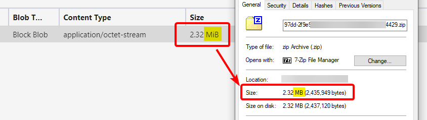
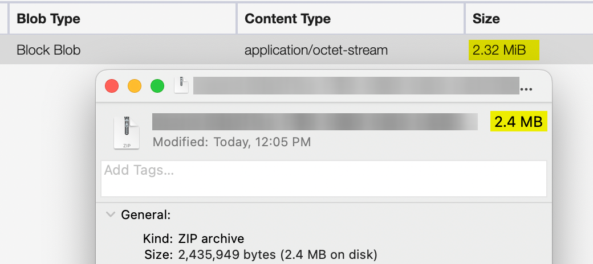
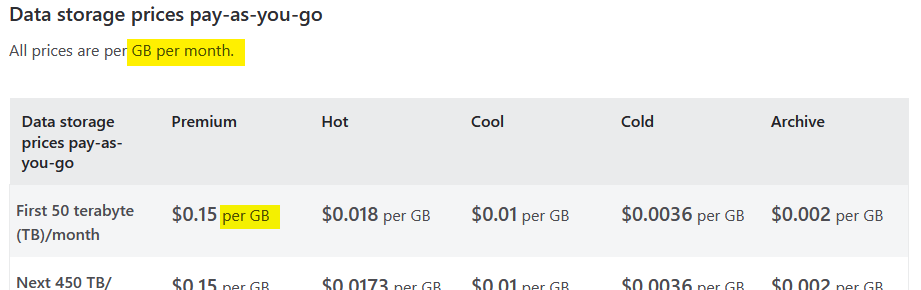

+++
date = 2025-01-18
title = "When is a Kilobyte not a Kilobyte?"
description = "This blog post delves into the historical and technical inconsistencies in the use of the term Kilobyte across different platforms and systems. It highlights the confusion caused by varying definitions and measurements, and emphasizes the importance of understanding these differences, especially in contexts like cloud storage billing."

[extra]
promo_image = "promo-when-is-a-kilboyte-not-a-kilobyte.png"

[taxonomies]
tags = ["Cloud"]
+++

This is mainly a rant on the inconsistencies I found with "Kilobyte" while building a cross-platform file backup application.

We are developers, right? Historically, developers have used KB, and we trusted that it meant 1024 bytes. This assumption holds true in Microsoft codebases where [you can see](https://github.com/Azure/azure-sdk-for-net/blob/3fb80ad8a72712bd790243ad31283f87bdc20a6d/sdk/storage/Azure.Storage.Common/src/Shared/Constants.cs#L11) they've defined `public const int KB = 1024`. The same was true with the code I wrote or reviewed.

However, in 1998, the International Electrotechnical Commission (IEC) introduced binary prefixes (KiB, MiB, GiB) to create a clear distinction between decimal and binary units. This standard helped resolve the confusion between the two systems, especially as storage capacities grew larger. At some point, in the early 2000s, regular consumers began purchasing computer hardware at their local CompUSA. I remember noticing that hard drives started carrying a disclaimer like "1 MB = 1,000,000 bytes." Seagate has an excellent article on this [here](https://www.seagate.com/support/kb/lacie/why-does-my-hard-drive-report-less-capacity-than-indicated-on-the-drives-label-172191en/?form=MG0AV3).

Marketing won, and hence the confusion ensued.

My frustration really cranks up at the union of code, operating systems, and cloud provider billing.

To be honest, I never paid much attention to the "KiB", "MiB", "GiB" units seen in tools like Azure Storage Explorer. I incorrectly assumed "MB == MiB"—why wouldn't I, right? Windows Explorer tells me they are the same thing.

But—when you start working cross-platform, pick up a Mac and see this, you get agitated:

What I've learned is that Windows traditionally uses base-2 (binary) measurements for file sizes (e.g., 1 MB = 1,048,576 bytes), while macOS has adopted base-10 (decimal) measurements since OS X 10.6 Snow Leopard (2009), where 1 MB = 1,000,000 bytes. This difference explains why the same file might show different sizes on different operating systems.

This led me to the embarrassing realization that the [difference between KB (Kilobyte) and KiB (Kibibyte)](https://physics.nist.gov/cuu/Units/binary.html) is significant. 

So the same file of `2,435,949` bytes is seen on

| File Browser           | Reported Size |
| ---------------------- | ------------: |
| Windows Explorer       |       2.32 MB |
| macOS finder           |        2.4 MB |
| Azure storage explorer |      2.32 MiB |

Now, the fact that Windows and macOS are reporting differently is not a big deal. It certainly is not the only difference between the operating systems. But, if you are using a Microsoft Azure tool (Azure Storage Explorer) to view items (blobs) in storage and you want to figure out how much that storage will cost, you would expect a little consistency, right?

Many cloud storage providers, including Azure, Google Cloud, and AWS, often use base-2 measurements (GiB) for billing and storage capacity, while some user interfaces might display sizes in base-10 (GB). It is crucial to understand the billing units to avoid surprises in costs.

Let's jump to the [Azure Storage Pricing](https://azure.microsoft.com/en-us/pricing/details/storage/blobs/)—oh they're billing on `GB`. 

**BUT WAIT—THERE'S A DISCLAIMER**

> Azure Blob Storage usage is **calculated in binary Gigabytes (GB)**, where 1 GB = 2^30 bytes. **This unit of measurement is also known as Gibibyte (GiB)**, defined by the International Electrotechnical Commission (IEC). Similarly, 1 TB is 2^40 bytes, i.e. 1,024 GBs.

Azure are you drunk? You're telling me "[GB] is also known as Gibibyte (GiB)"?

Only in marketing.

