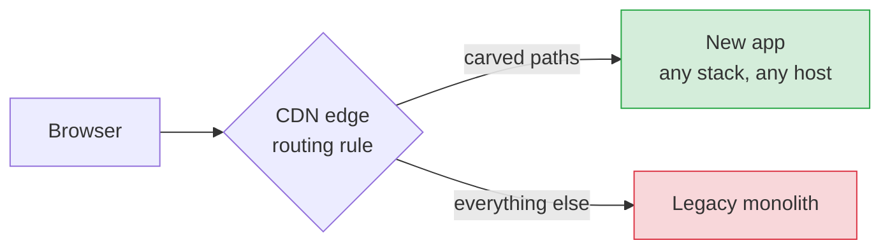
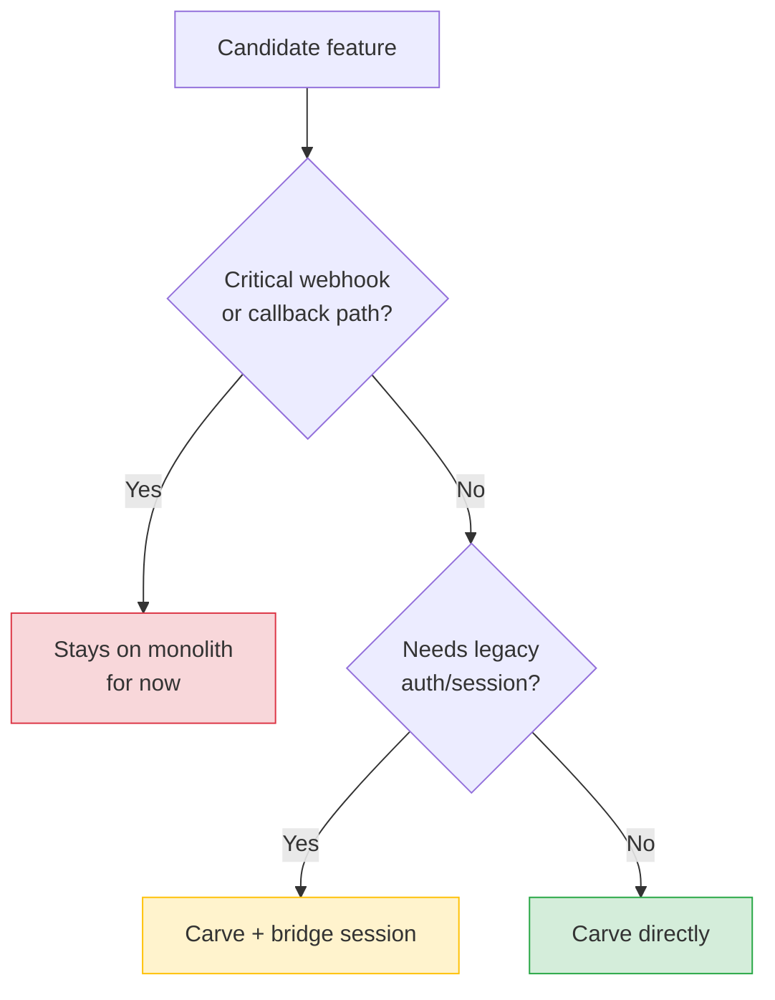

+++
date = 2026-05-07
title = "Strangling a 20-Year-Old Monolith from the Edge"
description = "Strangling a legacy monolith used to be an eighteen-month bet that rarely shipped. Now it looks like a quarter of focused work. Here's what changed."

[extra]
promo_image = "promo-strangling-a-20-year-old-monolith-from-the-edge.png"

[taxonomies]
tags = ["AI", "Cloud", "Architecture"]
+++

I've been thinking about legacy modernization a lot lately, and I figured I would share where I've landed.

If you've ever worked on a codebase that's older than some of your coworkers, you already know the standoff. You can ship features *or* you can modernize. Never both. A full rewrite wants eighteen months, a VP willing to bet their job on the timeline, and a coin flip on whether it ever ships. Meanwhile the code quietly ages out of the talent pool. Try hiring someone who's excited to work on a fifteen-year-old codebase and let me know how that goes.

<!-- more -->

The strangler-fig pattern has been the textbook answer for a decade. Peel features off the old app one at a time, route them to a new app, retire the old one when nothing's left. The pattern is right. The reason it rarely worked in practice is that *both halves of the strangler* used to be expensive. Building the replacement was a project, routing users to it was a project, and the projects added up faster than anyone could deliver them.

That just changed. Both halves got cheap at roughly the same time, and I don't see enough people talking about what that means together.

## The two things that just got cheap

**Building the replacement.** A small team, or honestly one engineer with an LLM in the loop, can stand up a production-quality, narrow-scope frontend in days. Pick a stack, scaffold it, ship it. The new app doesn't have to be a "pick the company's tech stack for the next decade" decision anymore. It can be a per-feature one.

**Routing users to it.** If your traffic already runs through a CDN like Cloudflare, Fastly, or CloudFront, you already have a programmable reverse proxy in production. Modern CDNs let you run a few lines of code at the edge to decide, per request, which origin serves it. You don't need new infrastructure to start carving.

Either one alone is interesting. Together they change the math.

## The pattern in one picture

The carved-path list is a config file. Adding a path is one line. Removing one is a revert. The browser sees the same hostname throughout... cookies, analytics, hardcoded URLs, search rankings, all untouched.

That's the whole mechanism. The rest is just what falls out of it.

## Why this actually makes the rewrite less scary

This is the part I think matters most to anyone funding the work:

- **Every carve is reversible in seconds.** No bandage-rip moment. If a carved feature regresses, you revert one line and traffic flows back to the monolith.
- **Independent release cadence.** The new surface ships on its own clock. The monolith ships on its own clock. Neither team is waiting on the other.
- **No legacy-stack tax on new work.** Whoever builds the carved surface doesn't need expertise in the old framework, doesn't need access to the monolith's deploy pipeline, doesn't need to understand decade-old auth code on day one.
- **You can change your mind cheaply.** Carve a path, run it for a quarter, un-carve if it didn't work, try a different team or stack. The cost of being wrong is a config revert, not a sunk rewrite.

The shape of the migration changes too. Instead of one heroic project with a pass/fail outcome, you get a stream of small, independently-valuable carves. Each one ships, each one teaches you something, each one is reversible.

## What this doesn't solve

It's worth being honest about the limits, because the pattern is easy to oversell and I've watched people oversell it:

- **Auth and session bridging.** The browser sends cookies to whatever origin serves the path. If a carved surface needs login, somebody is bridging sessions between the two apps. That's a real piece of work, separate from the routing.
- **Shared data.** Two apps talking to one database is the same coordination problem it always was.
- **The rewrite itself.** This is a *routing* strategy. It buys you incremental migration. The LLMs help write the new code, and the edge gets users to it. Neither one writes the migration plan for you.
- **Critical webhook paths.** Payment callbacks, password-reset links, OAuth redirects... these stay on the legacy app until you have an explicit plan to move them. The edge makes carving easy, which means it also makes carving the wrong thing easy.

## How I decide what to carve next

Most candidate features land on the green path. The yellow path is real work but bounded. The red path is the inventory you keep in a separate list and address with intent, not by accident.

## Operating it without surprises

A few things will bite you if you skip them. Treat enabling the proxy and deploying the first carve as separate releases. Don't compound the blast radius. Audit cache rules *before* the proxy flip; the defaults will surprise you. Use strict TLS validation between the edge and the new origin. None of this is exotic. All of it is the kind of thing that turns a clean rollout into a postmortem if you ignore it.

## Treat the edge as code

One warning, because it's the difference between "incremental migration" and a routing rule nobody remembers exists: don't manage these rules in a CDN dashboard. Every modern CDN has an API. Wrap it in your existing deploy scripts, put the routing config in source control, and PR-review it like any other code. *I've got a future post coming on the as-code shape of this... that one will have actual code in it.*

## The bigger shift

For two decades, legacy modernization was a capacity problem. Too much code to rewrite, too few people who wanted to work on it, no incremental path that actually worked in practice. The strangler-fig pattern was correct on paper and rarely shipped, because the seam was a project, and each replacement surface was a project, and the projects added up faster than the team could deliver them.

LLM-assisted development cut the cost of *building the new thing.* Edge-programmable CDNs cut the cost of *routing users to the new thing.* Neither change is dramatic on its own. Together they collapse the cost of the only migration pattern that's historically worked.

The migrations that used to need executive sponsorship and an eighteen-month roadmap are starting to look like a quarter of focused carving. The twenty-year monolith isn't a liability anymore.

It's a runway.